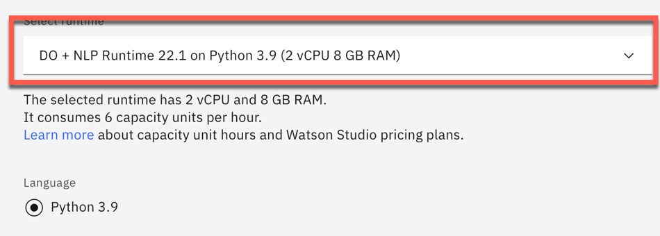

# Watson NLP custom model

This project contains assets and information related to create a custom Watson NLP for Embed models.

Related blog post [`Customize a model for Watson NLP`](https://suedbroecker.net/2023/01/17/customize-a-model-for-watson-nlp/) and [`Watson NLP for Embed` customize a classification model](TBD).

* Customize the model for `Watson NLP`
* Run `Watson NLP for Embed` with a customized model on the local computer

## Customize the model for Watson NLP

### Step 1: Familiarize yourself with `Watson Studio`

Follow the steps of the blog post [`Customize a model for Watson NLP`](https://suedbroecker.net/2023/01/17/customize-a-model-for-watson-nlp/) to get familiar with the `Watson Studio`.

### Step 2: Clone the project to your local computer

```sh
git clone https://https://github.com/thomassuedbroecker/watson-nlp-custom-model.git
cd watson-nlp-custom-model
```

### Step 3: Open your Watson Studio project on IBM Cloud

### Step 4: Select `New asset`


### Step 5: Press `Jupyther notebook editor`


### Step 6: Select runtime `Jupyther notebook editor`

* Runtime: `DO + NLP Runtime 22.1 on Python 3.9 (2 CPU 8 GB RAM)`




### Step 7: Upload the `Jupyther notebook` file `watson-nlp-custom-model-for-text-classification.ipynb` from your local machine and press `Create`

Location of the file `YOUR_PATH/watson-nlp-custom-model/juypter-notebook/watson-nlp-custom-model-for-text-classification.ipynb`.


### Step 8: Execute the steps in the `Jupyter notebook`


Link to the notebook: [Watson NLP custom model for text classification](https://github.com/thomassuedbroecker/watson-nlp-custom-model/blob/main/jupyter-notebook/watson-nlp-custom-model-for-text-classification.ipynb).


## Run Watson NLP for Embed with a customized model on the local computer

> _Note:_ Your need to create a customized model and save it in the `docker/app/models` folder.

### Step 1: Clone the repository

```sh
git clone https://https://github.com/thomassuedbroecker/watson-nlp-custom-model.git
cd watson-nlp-custom-model
```

### Step 2: Navigate to the `docker` folder

```sh
cd docker
```

### Step 3: Create a `.env` file

```sh
cat .env_template > .env
```

### Step 4: Add an IBM Cloud access key to your local `.env` file

```sh
nano .env
```

Content of the file:

```sh
export IBM_ENTITLEMENT_KEY="YOUR_KEY"
export IMAGE_REGISTRY="cp.icr.io/cp/ai"
export RUNTIME_IMAGE="watson-nlp-runtime:1.0.20"
export WATSON_RUNTIME_BASE="$IMAGE_REGISTRY/$RUNTIME_IMAGE"
```

### Step 5: Execute the bash automation

>The creation can take up to 10 minutes for the download of the runtime image.

```sh
sh run-watson-nlp-with-docker.sh
```

* Example output:

```sh
# ******
# Connect to IBM Cloud Container Image Registry: cp.icr.io/cp/ai
# ******

IBM_ENTITLEMENT_KEY: 
...

Login Succeeded

# ******
# Build container image locally
# Runtime container image: cp.icr.io/cp/ai/watson-nlp-runtime:1.0.20
# ******
[+] Building 0.2s (7/7) FINISHED                                  
 => [internal] load build definition from 
 ...
 
# ******
# Run NLP
# ******

# Run the runtime with the models mounted

[STARTING RUNTIME]
...
"2023-01-25T20:25:07.040114"}
[STARTING GATEWAY]
2023/01/25 20:25:07 Running with INSECURE credentials
2023/01/25 20:25:07 Serving proxy calls INSECURE
```

### Step 6: Open a new terminal and insert following `curl` command

```sh
curl -s -X POST "http://localhost:8080/v1/watson.runtime.nlp.v1/NlpService/ClassificationPredict" \
  -H "accept: application/json" \
  -H "grpc-metadata-mm-model-id: ensemble_model" \
  -H "content-type: application/json" \
  -d "{ \"rawDocument\": \
    { \"text\": \"The credit card doesn't work, and I look at the savings, but I need more money to spend.\" }}" | jq
```

* Example output:

```sh
{
  "classes": [
    {
      "className": "Credit card or prepaid card",
      "confidence": 0.5404788
    },
    {
      "className": "Debt collection",
      "confidence": 0.22745371
    },
    {
      "className": "Credit reporting, credit repair services, or other personal consumer reports",
      "confidence": 0.22019744
    },
    {
      "className": "Checking or savings account",
      "confidence": 0.100063786
    },
    {
      "className": "Mortgage",
      "confidence": 0.043992974
    }
  ],
  "producerId": {
    "name": "Voting based Ensemble",
    "version": "0.0.1"
  }
}
```
